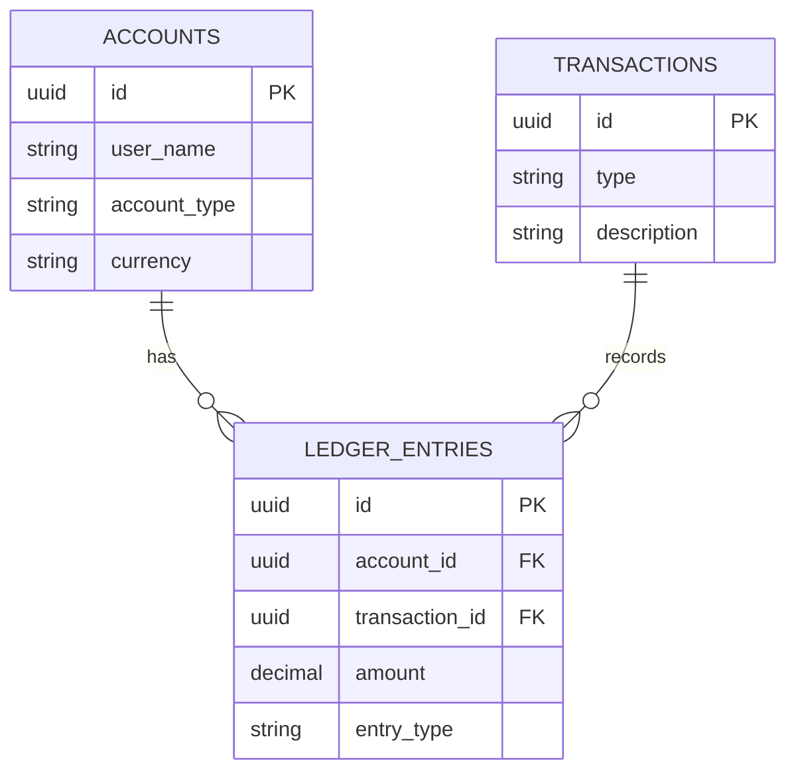

# Robust Financial Ledger API

This is a production-grade, containerized Node.js API implementing a double-entry bookkeeping model with strict ACID compliance and pessimistic locking.

## Project Structure
.
├── cmd/api/server.js          # Entry point and route definitions
├── internal/
│   ├── account/               # Account management (Controller & Service)
│   ├── ledger/                # Financial operations & ACID logic
│   └── db/index.js            # Database pool configuration
├── scripts/init.sql           # Database schema
├── Dockerfile                 # API container configuration
├── docker-compose.yml         # Orchestration (App + Postgres)
└── Ledger_API_Tests.json      # Postman collection

---

### 2. API Endpoints Summary
Providing a quick reference table helps the person testing your app understand what is available without reading all the code.

```markdown
## 🔌 API Endpoints Reference

| Method | Endpoint | Description |
| :--- | :--- | :--- |
| `POST` | `/accounts` | Create a new account (Alice/Bob) |
| `GET` | `/accounts/:id` | Get account details & on-demand balance |
| `GET` | `/accounts/:id/ledger` | Get full immutable audit trail |
| `POST` | `/deposits` | Add funds to an account |
| `POST` | `/withdrawals` | Remove funds (Check for insufficient funds) |
| `POST` | `/transfers` | Move money between accounts (ACID compliant) |

---

## Quick Start (Docker Setup)

1. **Prerequisites**: Install [Docker Desktop](https://www.docker.com/products/docker-desktop/).
2. **Setup**: Clone this repository and navigate to the root folder.
3. **Run Project**: Execute the following command:
   ```bash
   docker-compose up --build
   ```
4. **Access**:The API is live at http://localhost:3000.


## Design Decisions & Rationale

### 1. Double-Entry Bookkeeping Model
We implemented a strictly append-only ledger. Every financial movement (transfer) results in two balanced entries:

Debit Entry: A negative amount recorded for the from_account_id.

Credit Entry: A positive amount recorded for the to_account_id.

Atomic Link: Both entries share a unique transaction_id. This ensures the system-wide balance net change for any transaction is always zero.

### 2. Ensuring ACID Properties
To ensure financial integrity, all transactions use the following strategy:

Atomicity: Every transfer, deposit, and withdrawal is wrapped in a BEGIN and COMMIT block. Any failure triggers an immediate ROLLBACK.

Consistency: The database schema enforces UUID types, foreign keys, and decimal precision.

Isolation: We prevent race conditions using row-level locking.

Durability: Data is persisted in a PostgreSQL volume, ensuring it survives container restarts.

### 3. Transaction Isolation & Concurrency
Choice: READ COMMITTED with Pessimistic Locking.

Rationale: We use SELECT ... FOR UPDATE on the account identity row before performing balance calculations. This locks the specific account being debited, preventing "double-spending" where concurrent requests try to spend the same balance simultaneously.

### 4. Balance Calculations & Negative Balance Prevention
On-Demand Calculation: We do not store a "balance" column in the accounts table. Balances are calculated by executing SUM(amount) across all ledger entries for a specific account_id.

Prevention: Within the transaction block, the service calculates the current sum. If the current_balance - withdrawal_amount < 0, the process throws an Insufficient funds error and rolls back the transaction.

# System Diagrams
## Architecture Diagram
### 1. Database Schema (ERD)

### 2. The Architecture Diagram (Transfer Flow)
### Architecture Diagram: Transfer Flow
sequenceDiagram
    participant Client
    participant API as Express Controller
    participant Service as Ledger Service
    participant DB as PostgreSQL

    Client->>API: POST /transfers
    API->>Service: executeTransfer()
    Service->>DB: BEGIN Transaction
    Service->>DB: SELECT FOR UPDATE (Lock Account)
    Service->>DB: INSERT Transaction Header
    Service->>DB: INSERT Ledger Entries (Debit/Credit)
    Service->>DB: COMMIT
    DB-->>Service: Success
    Service-->>API: Transaction ID
    API-->>Client: 201 Created

# Testing with Postman
1. Import the Ledger_API_Tests.json file into Postman.

2. Setup: Run "Create Alice" and "Create Bob" requests.

3. Variables: Copy the returned UUIDs into Postman environment variables alice_id and bob_id.

4. Execution: Run the remaining tests in order to verify:

5. Deposit: Successful credit entry.

6. Transfer: Successful double-entry (Debit/Credit).

7. Failure Case: Attempt a transfer larger than the balance to verify ACID rollback.

8. Audit Case: Fetch /ledger to verify the immutable audit trail.

## Robustness & Immutability
Immutable Ledger: The API lacks PUT, PATCH, or DELETE endpoints for ledger entries, enforcing an append-only audit trail.

Error Handling: Standardized JSON responses for 400 (Bad Request), 422 (Insufficient Funds), and 500 (Server Error).